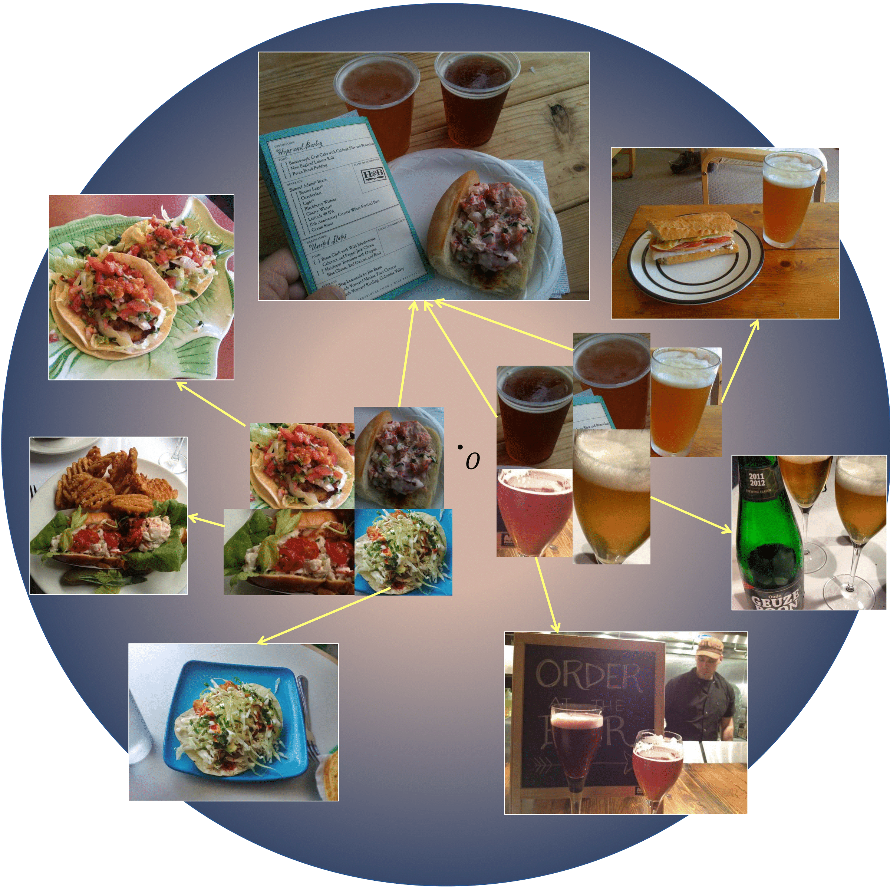

This repo contains the pytorch implementation of the paper: **Hyperbolic Contrastive Learning for Visual Representations beyond Objects (CVPR 2023).**

<p align="center">
  
</p>


The openimages dataset can be downloaded from this github repo https://github.com/shlokk/object-cropping-ssl.

To run the HCL scripts 
```
python main_hcl.py -a resnet50 --lr 0.15 --batch-size 128 --c 0.05 \
                               --dist-url 'tcp://localhost:10024' --world-size 1 --rank 0 --moco-dim 128 \
                               -j 8 --moco-t 0.2 --mlp --aug-plus --cos --save_name run_v5_cpcp_moco1_hyperbolic0.1_coupled_random_boxes_dim128 \
                               --save_dir . --multiprocessing-distributed --dataset-type hierarchy_diff_crop --theta-moco 1 --theta-hyperbolic 0.1 \
                               --DATAPATH  'path to all_images' 
```
```
Lincls script:
python main_lincls.py \
  -a resnet50 \
  --lr 30.0 \
  --batch-size 256 \
  --pretrained [your checkpoint path]/checkpoint_0199.pth.tar \
  --dist-url 'tcp://localhost:10001' --multiprocessing-distributed --world-size 1 --rank 0 \
  [your imagenet-folder with train and val folders]
```

## BibTeX

```
@article{Ge2022HyperbolicCL,
  title={Hyperbolic Contrastive Learning for Visual Representations beyond Objects},
  author={Songwei Ge and Shlok Kumar Mishra and Simon Kornblith and Chun-Liang Li and David Jacobs},
  journal={ArXiv},
  year={2022},
  volume={abs/2212.00653}
}

@article{
mishra2022objectaware,
title={Object-aware Cropping for Self-Supervised Learning},
author={Shlok Kumar Mishra and Anshul Shah and Ankan Bansal and Janit K Anjaria and Abhyuday Narayan Jagannatha and Abhishek Sharma and David Jacobs and Dilip Krishnan},
journal={Transactions on Machine Learning Research},
year={2022},
url={https://openreview.net/forum?id=WXgJN7A69g},
note={}
}
```
